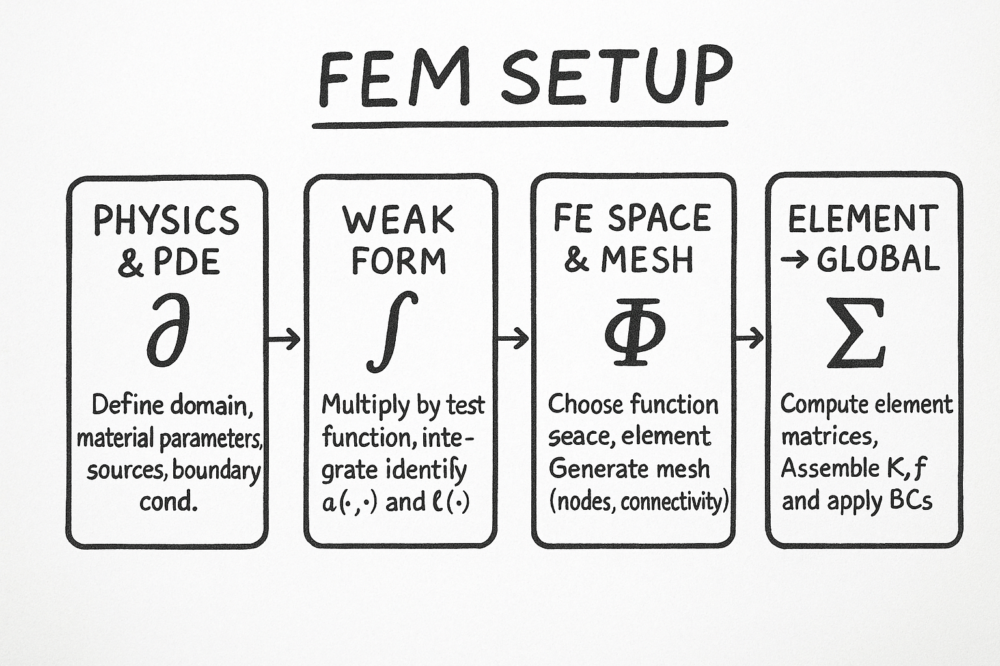

# maxNotSoWell
DIY software package to solve Maxwell's equations using Finite Element (FE) Methods.

As of right now (December 2025), the package only supports an explicit formulation of the problem as FE matrix statements. 
Thereby, the classes built so far only allow for 2D-electrostatic and -magneto-quasi-static problems to be solved, but 
the material and charge density (as well as the current density, respectively) can be specified via callables. 

The procedure of deriving an FE setup (which shall cover more cases and be more user-friendly, perspectively) is 
illustrated above and can be traced in the following example of the magnetic field caused by a current density, i.e.,

$$\nabla \times \left(\frac{1}{\mu}\nabla \times \mathbf{A}\right) = \mathbf{J}, 
\quad \text{in} \quad \Omega\subseteq\mathbb{R}^3, 
\quad \text{where}\quad \mathbf{n}\times \mathbf{A} = \mathbf{0} \quad\text{on}\quad\partial \Omega.$$

In the partial differential equation above, $\mathbf{A}$ is the magnetic vector potential, $\mathbf{n}$ is normal to 
the boundary, and $\mathbf{B} = \nabla \times \mathbf{A}$ is the magnetic flux density, while $\mathbf{J}$ is the applied 
current density and $\mu$ is the permeability of the material. Both $\mathbf{J}$ and $\mu$ may depend on the location.

One begins by deriving the so-called weak formulation of the equation in question. It is weak in the sense that derivatives 
of its solutions (called test functions) are no longer required to necessarily exist everywhere. This allows one to apply 
linear algebra to the solution of these differential equations, in particular, to add and scale solutions. While there is 
no one-size-fits-all solution for this problem, there are a number of useful formulae one can apply, and many problems of 
practical interest have already been solved. 

Formally (as per the Wikipedia pages on the topic), if $V$ ist a vector space and $A:V\to V^\star$ is a linear map from 
$V$ to its dual space, let $f\in V^\star$.
For all intents and purposes, $V$ may be a space of functions, and $A$ may be a derivative operator. This facilitates the
formulation of differential equations in this framework. A vector $u$ is a solution of 

$$Au = f \quad\text{iff}\quad (Au)(v) = f(v) \quad\text{for all}\quad v\in V.$$

A particular $v$ is called a test vector. To obtain the weak formulation, one requires to find $u\in V$ such that

$$a(u,v) \triangleq (Au)(v) = f(v) \quad\text{for all}\quad v\in V,$$

where $a$ is a bilinear form.

For the problem above, one begins by left-multiplying the equation with the test vector $\mathbf{w}$ and integrating over 
the domain:

$$\int_\Omega \mathbf{w}\cdot \left[\nabla \times \left(\mu^{-1}\nabla \times \mathbf{A}\right)\right] \mathrm{d}V
 = \int_\Omega \mathbf{w}\cdot \mathbf{J}  \mathrm{d}V.$$

Using the vector identity 

$$\nabla\cdot\left(\mathbf{u}\times\mathbf{v}\right) = \left(\nabla\times\mathbf{u}\right)\cdot\mathbf{v}- 
\mathbf{u}\cdot\left(\nabla\times\mathbf{v}\right),$$

one rewrites the above as

$$\int_{\partial\Omega} \mathbf{n}\cdot\bigl(\mathbf{w}\times(\mu^{-1}\nabla\times\mathbf{A})\bigr) \mathrm{d}V =
\int_{\Omega} (\nabla\times\mathbf{w})\cdot(\mu^{-1}\nabla\times\mathbf{A}) \mathrm{d}V -
\int_{\Omega} \mathbf{w}\cdot\bigl(\nabla\times(\mu^{-1}\nabla\times\mathbf{A})\bigr) \mathrm{d}V,$$

where $\mathbf{n}$ is normal to the boundary. This was obtained by invoking the divergence theorem, which replaces the 
volume integral by a surface integral:

$$\int_{\Omega} \nabla\cdot\bigl(\mathbf{w}\times(\mu^{-1}\nabla\times\mathbf{A})\bigr) \mathrm{d}V =
\int_{\partial\Omega} \mathbf{n}\cdot\bigl(\mathbf{w}\times(\mu^{-1}\nabla\times\mathbf{A})\bigr) \mathrm{d}S =
\int_{\partial\Omega} (\mathbf{n}\times\mathbf{w})\cdot\bigl(\mu^{-1}\nabla\times\mathbf{A}\bigr) \mathrm{d}S.$$

Plugging in the PDE then yields

$$\int_\Omega \mathbf{w}\cdot \mathbf{J}  \mathrm{d}V = 
\int_{\Omega} (\nabla\times\mathbf{w})\cdot(\mu^{-1}\nabla\times\mathbf{A}) \mathrm{d}V -
\int_{\partial\Omega} (\mathbf{n}\times\mathbf{w})\cdot\bigl(\mu^{-1}\nabla\times\mathbf{A}\bigr) \mathrm{d}S.$$

Now, since the boundary conditions are purely of Dirichlet type, the boundary term vanishes, therefore,

$$a(\mathbf{w},\mathbf{A}) \triangleq \int_{\Omega} (\nabla\times\mathbf{w})\cdot(\mu^{-1}\nabla\times\mathbf{A}) 
\mathrm{d}V = \int_\Omega \mathbf{w}\cdot \mathbf{J}  \mathrm{d}V \triangleq l(\mathbf{w}).$$

This is the weak form of the problem.

We now want (and have) to assume that both $\mathbf{A}$ and the test function $\mathbf{w}$ belong to the space of 
$H(\text{curl})$ vector-valued functions, that is, functions whose curl is 
square-integrable (i.e., belongs to the $L^2$ space). Therefore, $\mathbf{A}$ and $\mathbf{w}$ can be approximated using 
basis functions $\mathbf{N}_i\in V_h \subset H(\text{curl})$ (referred to as Nédélec basis functions), namely

$$\mathbf{A}_h = \sum_{j=1}^{p} a_j \mathbf{N}_j,\quad \mathbf{w}_h = \mathbf{N}_{q},$$

so the above integral expands as

$$\sum_{j=1}^{p} a_j \int_{\Omega} (\nabla\times\mathbf{N}_i)\cdot(\mu^{-1}\nabla\times\mathbf{N}_j) 
\mathrm{d}V = \int_\Omega \mathbf{N}_q\cdot \mathbf{J}  \mathrm{d}V,$$

The matrix form $\mathbf{K}\mathbf{a}=\mathbf{f}$ of this equation with

$$K_{ij} = \int_{\Omega} (\nabla\times\mathbf{N}_i)\cdot(\mu^{-1}\nabla\times\mathbf{N}_j)  \mathrm{d}V,\quad 
f_i = \int_\Omega \mathbf{N}_i\cdot \mathbf{J}  \mathrm{d}V$$

is what is solved when FE methods are applied. Therein, $i$ indexes the test function (approximate solution of the PDE) 
and $j$ indexes the basis functions. Depending on the applied procedure, the integrals are numerically solved, 
which is usually cheap because only few basis functions will be nonzero around each element. The formulae can usually be 
cast in closed form because element areas and volumes are available.

A final remark for completeness: in their simplest form (triangles in 2D), the Nédélec elements use the basis functions

$$\begin{pmatrix}
1\\
0
\end{pmatrix},\quad\begin{pmatrix}
0\\
1
\end{pmatrix},\quad\begin{pmatrix} 
y\\
-x
\end{pmatrix},
$$

which are precisely the vector fields tangent to the triangle edges.
